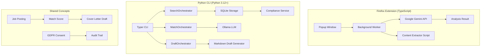
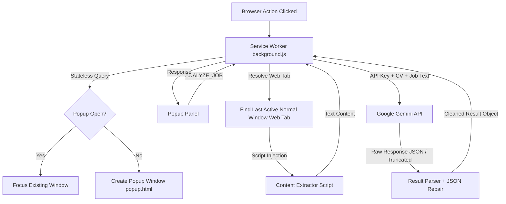
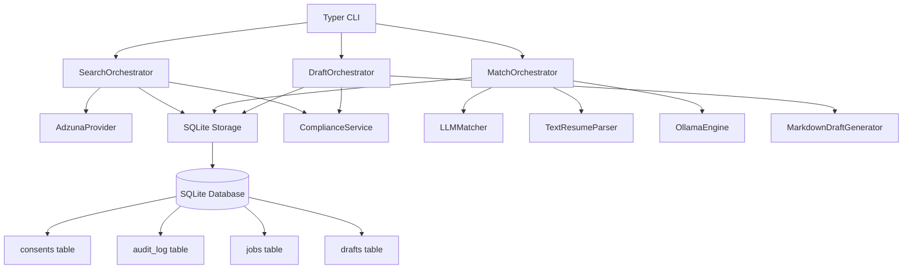
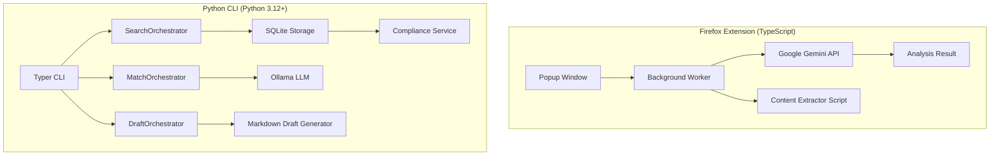

# Job Matcher AI

[](https://addons.mozilla.org/ru/firefox/addon/job-matcher-ai/)
[]()
[]()

> ⚠️ **Beta-Phase** – Dieses Projekt ist aktiv in Entwicklung. Kernfunktionen laufen stabil,
> aber es kann zu Fehlern kommen. Ich lade **Entwickler:innen und Jobsuchende ein**,
> mitzuhelfen, das Add-on zur Release-Qualität zu bringen!

---

**Job Matcher AI** besteht aus zwei unabhängigen Anwendungen in einem Repository:

1. **Firefox-Erweiterung** (TypeScript) – Analysiert Stellenanzeigen live im Browser mit **Google Gemini API**
2. **Python CLI** (Python 3.12+) – DSGVO-konforme CLI-Version mit **lokalem LLM (Ollama)** und **offiziellen Job-APIs** (Adzuna, Indeed)

Beide Anwendungen teilen dieselbe Idee: Eingehende Stellenanzeigen mit dem eigenen Lebenslauf vergleichen und passgenaue Anschreiben (Cover Letters) generieren – ohne die Privatsphäre zu gefährden.

---

## 🔧 Mitmachen & Beta

**Job Matcher AI ist in der Beta-Phase.** Das bedeutet:

### ✅ Was bereits funktioniert (Firefox-Extension)
- Job-Analyse auf StepStone, Indeed, LinkedIn, XING, Arbeitsagentur, HeyJobs u. a.
- Anschreiben-Generierung (Deutsch) ab konfigurierbarem Score
- Sprach-Assistent (Fragen per Mikrofon)
- Lokale History (letzte 20 Auswertungen)
- 0 Lint-Fehler/Warnungen (AMO-konform)

### ✅ Was bereits funktioniert (Python CLI)
- **Jobsuche** über offizielle Adzuna-API
- **Resume-Matching** mit lokalem LLM (Ollama, `llama3.2:3b`)
- **Draft-Generierung** für Anschreiben (nur Entwurf – keine automatische Zusendung)
- **GDPR/DSGVO-Compliance**: Consent-Management + vollständiges Audit-Log
- **SQLite-Speicher**: Jobs, Resumes, Matches, Drafts, Consents und Audit-Trail
- **CLI-Befehle**: `search`, `match`, `draft`, `consent`, `audit`, `drafts`

### 🔧 Woran noch gearbeitet wird
- Live-Tests mit echten API-Keys
- Weitere Edge-Case-Tests (leere Antworten, Netzwerkfehler)
- Integration weiterer Job-Plattformen (Indeed Partner API)
- README-Ergänzung um Installationsanleitung für das Python-CLI

### 🤝 Wie du helfen kannst
- **Issues melden** – Fehler oder Verbesserungsvorschläge
- **Pull Requests** – Code, Tests, Docs, Übersetzungen
- **Feedback geben** – Funktioniert es auf deiner Lieblings-Jobseite?
- **Ideen teilen** – Welche Funktion fehlt dir?

Du brauchst kein Frontend-Profi zu sein. Das Projekt wurde selbst mit LLM-Unterstützung entwickelt – jede Hilfe ist willkommen!

---

## Table of Contents

- [Dual-App Architecture](#dual-app-architecture)
- [Firefox Extension](#firefox-extension)
  - [Key Features](#key-features)
  - [Workflow](#workflow-firefox-extension)
  - [Installation & Test](#installation--test-in-firefox-for-developer)
- [Python CLI](#python-cli)
  - [Key Features](#python-cli-key-features)
  - [Architecture](#python-cli-architecture)
  - [Installation](#python-cli-installation)
  - [Commands](#python-cli-commands)
  - [Configuration](#python-cli-configuration)
- [German Application Best Practices & the "Übersetzungs-Regel"](#german-application-best-practices--the-übersetzungs-regel)
- [Security & Privacy Standards](#security--privacy-standards)
- [Developer Guide](#developer-guide)
  - [Prerequisites](#prerequisites)
  - [Build and Run Tasks](#build-and-run-tasks)
  - [Testing](#testing)
- [License](#license)

---

## Dual-App Architecture



### Unterschiede zwischen den Versionen

| Aspekt | Firefox Extension (TypeScript) | Python CLI |
|--------|-------------------------------|------------|
| **AI Engine** | Google Gemini API (Cloud) | Ollama (lokal, `llama3.2:3b`) |
| **Job-Quelle** | Web Scraping (aktiver Tab) | Offizielle Job-API (Adzuna) |
| **Betrieb** | Browser-Add-on (Client-seitig) | Terminal (Standalone) |
| **Compliance** | DSGVO via Gemini-Bedingungen | DSGVO/BDSG mit Consent + Audit |
| **Draft-Modus** | Optional (abhängig von Score) | **Immer Entwurf** (erzwungen) |
| **Datenspeicher** | `chrome.storage.local` | SQLite-Datenbank |
| **CV-Format** | PDF (als Base64) | Text/Raw |
| **Interface** | GUI-Popup | CLI (Typer) |

---

## Firefox Extension

Die Firefox-Erweiterung ist die ursprüngliche Version von Job Matcher AI. Sie läuft direkt im Browser und analysiert live die aktuell geöffnete Stellenanzeige.

### Key Features

- **Automated Content Extraction**: Reads and parses the text of the job description page automatically—even from copy-protected web pages—by avoiding standard `innerText` blocks and walking the DOM using `textContent`.
- **Match Score & Feedback**: Rates match quality on a scale from 1 to 10 and provides a detailed German explanation of matched and missing skills.
- **Cover Letter Generation**: Automatically writes a professional, tailor-made German cover letter if the match score is at least 7/10 (user-configurable).
- **Voice Assistant**: Allows you to record and ask voice questions via your microphone, using Gemini to respond instantly in German.
- **Stateless Window Lock & Bounds Constraint**:
  - Automatically restricts the extension popup window from spawning duplicates; multiple clicks on the icon focus the existing window.
  - Keeps the popup window nested strictly within the boundaries of your active browser window, preventing it from being dragged off-screen.
- **History Log**: Keeps a local history of your last 20 evaluations (stored locally inside `chrome.storage.local`).
- **Ubuntu Design System**: A premium dark-mode interface styled according to the Ubuntu design palette and font guidelines.
- **AMO-konform**: 0 Lint-Fehler/Warnungen, XSS-sichere Ausgabe, vollständige CSP.

### Workflow (Firefox Extension)



#### Detaillierter Ablauf

1. **Installation** – `manifest.json` (MV3) registriert `background.js`, `popup.html`, `options.html`. Berechtigungen: `activeTab`, `scripting`, `storage`, `<all_urls>`, `generativelanguage.googleapis.com`. Background-Worker startet und trackt `lastActiveTabId` + `lastNormalWindowId`.

2. **Erster Start – API-Key eingeben** – Toolbar-Klick → Background öffnet Popup-Fenster (rechts vom Hauptfenster). `#setup`-View zeigt Passwortfeld + "Save". Key wird in `chrome.storage.local["geminiKey"]` gespeichert. Danach `#main`-View: "Stelle prüfen"-Button, "Upload CV"-Button.

3. **CV hochladen (.pdf)** – Button löst `<input type="file" accept=".pdf">` aus. `FileReader.readAsDataURL()` → base64 Data-URL. Gespeichert in Storage: `cvData`, `cvFileName`, `cvUploadedAt`.

4. **Job analysieren (Haupt-Workflow):**
   ```
   Popup: "Stelle prüfen" geklickt
     → chrome.runtime.sendMessage({ action: "ANALYZE_JOB" })
     → Background: analyzeJob({ tabId })

     1. API-Key und CV aus Storage laden
     2. resolveJobText(tabId):
        → chrome.scripting.executeScript() in die Job-Seite
        → In der Seite:
          - <h1> → Job-Titel
          - og:site_name → Firma
          - hostname → Quelle
          - DOM-Normalisierung:
            - Noise entfernen (script, style, nav, footer, cookies, etc.)
            - 20+ Selektoren priorisiert: main, [itemprop], .job-description, usw.
            - Fallback: document.body.textContent
            - Clean + truncate auf 10.000 Zeichen
        → return { text, source, title, company }

     3. Gemini-Request bauen:
        Model: gemini-2.5-flash (default, konfigurierbar)
        System-Prompt: HR-Assistent mit detaillierten Cover-Letter-Regeln
          * Übersetzungs-Regel: Anforderung → konkreter CV-Beleg
          * Deutsche Anschreiben-Struktur
          * outputJSON via responseSchema
        User-Parts:
          [0] Analysiere + Threshold (default: 7)
          [1] "STELLENANZEIGE ({source}):\n{text}"
          [2] inline_data: PDF als base64 (der CV)
          [3] Hinweis: CV als PDF angehängt

     4. POST https://generativelanguage.googleapis.com/...
        Retry: max 2× bei 429/5xx/network mit Backoff 800ms→1600ms
        Timeout: 60s

     5. Response parsen (5 Strategien):
        - Direkt JSON.parse
        - Code-Fence entfernen (```json)
        - Erstes { + letztes } suchen
        - Erstes [ + letztes ] suchen
        - truncated-JSON reparieren (Klammern schließen)

     6. AnalysisResult: score(1-10), reasoning, coverLetter?, language, matchedSkills, missingSkills

     7. HistoryEntry speichern (max 20) in chrome.storage.local

     8. response an Popup: { ok, result, model, threshold }
   ```

5. **Ergebnis im Popup:**
   - Score: farbcodiert (grün ≥7, orange 4-6, rot ≤3)
   - Begründung: Text
   - Passende Fähigkeiten / Fehlende Fähigkeiten: Listen
   - Anschreiben: Wenn `score ≥ threshold` → `<textarea>` mit Schreibschutz

6. **Einstellungen (`options.html`):**
   - API-Key ändern
   - Modell wechseln: `gemini-2.5-flash` / `gemini-2.5-pro` / `gemini-2.0-flash`
   - Threshold-Slider (1-10)
   - CV neu hochladen/löschen
   - History ansehen + löschen

### Wichtige Design-Entscheidungen (Firefox Extension)

- **Kein persistenter Content-Script**: Script wird per `executeScript` on-demand injiziert, keine dauerhafte Berechtigung
- **Kein automatischer Versand**: Nur manuelles Kopieren aus Textarea
- **PDF-only CV**: `application/pdf` als MIME-Type, base64 inline an Gemini
- **Gemini `responseSchema`**: Erzwingt JSON-Struktur, `coverLetter` ist optional
- **Audio-Integration**: Existiert (`AUDIO_SOLVE`), aber nicht im Popup-UI exponiert

### 🔧 Installation & Test in Firefox for Developer

#### 1. Firefox for Developer Edition herunterladen
→ [https://www.mozilla.org/de/firefox/developer/](https://www.mozilla.org/de/firefox/developer/)

#### 2. Add-on bauen
```bash
git clone <repo-url>
cd Job-Matcher-AI
npm install
npm run build
```

#### 3. Temporäres Add-on laden (about:debugging)
1. Öffne Firefox for Developer
2. Gehe zu `about:debugging#/runtime/this-firefox`
3. Klicke auf **„Dieses Firefox"**
4. Klicke auf **„Temporäres Add-on laden…"**
5. Wähle die Datei `dist/manifest.json` aus

#### 4. Alternative: web-ext (automatisches Neuladen)
```bash
npx web-ext run --source-dir=dist
```

#### 5. Testen
1. Gehe zu einer Stellenanzeige (z. B. StepStone, Indeed)
2. Klicke auf das Job Matcher AI-Icon
3. Gib Gemini-API-Key und Lebenslauf (PDF) in den Einstellungen ein
4. Klicke auf „Stelle prüfen"
5. Sieh dir Score, Begründung und Anschreiben an

#### 🔗 Nützliche Links

| Link | Beschreibung |
|------|-------------|
| [Firefox for Developer](https://www.mozilla.org/de/firefox/developer/) | Browser zum Testen unsigned Add-ons |
| [Gemini API Key](https://aistudio.google.com/apikey) | Kostenloser API-Key von Google |
| [AMO – Job Matcher AI](https://addons.mozilla.org/de/firefox/addon/job-matcher-ai/) | Veröffentlichte Version |

---

## Python CLI

Die Python CLI ist eine **DSGVO-konforme Neuentwicklung**, die als Ergänzung zur Firefox-Erweiterung entwickelt wurde. Sie verwendet ausschließlich lokale KI (Ollama) und offizielle Job-APIs – kein Web Scraping, kein Cloud-AI-Datentransfer.

### Python CLI Key Features

- **Draft-Only-Modus**: Alle generierten Anschreiben sind **ausschließlich Entwürfe** – `requires_manual_review = True` ist auf Modellebene erzwungen und kann nicht umgangen werden.
- **Lokales LLM**: Verwendet Ollama (`llama3.2:3b`) auf `localhost:11434` – Ihre Daten verlassen Ihren Rechner nicht.
- **Offizielle Job-APIs**: Adzuna (primär, kostenloser Zugang) und Indeed Partner API (sekundär).
- **GDPR/DSGVO-Compliance**: Vollständiges Consent-Management (grant/revoke/check) und Audit-Trail in SQLite.
- **Hexagonale Architektur**: Saubere Trennung von Domain, Storage, Providers (APIs), AI, Output und Services.
- **CLI via Typer**: 6 Befehle – `search`, `match`, `draft`, `consent`, `audit`, `drafts`.

### Python CLI Architecture



#### Schichten (Hexagonal)

| Layer | Verzeichnis | Beschreibung |
|-------|------------|-------------|
| **Domain** | `job_matcher_ai/domain/` | Pydantic-Modelle, ABC-Interfaces, Error-Hierarchie |
| **Storage** | `job_matcher_ai/storage/` | SQLite-Implementierung (WAL-Mode, 6 Tabellen) |
| **Providers** | `job_matcher_ai/providers/` | Adzuna-API, Indeed-API (HTTP-Clients) |
| **AI** | `job_matcher_ai/ai/` | Ollama-Engine, Resume-Parser, LLM-Matcher |
| **Output** | `job_matcher_ai/output/` | Markdown-Draft-Generator |
| **Service** | `job_matcher_ai/service/` | Orchestratoren, Compliance, Pipeline |
| **CLI** | `job_matcher_ai/cli/` | Typer-App (Einstiegspunkt) |

### Python CLI Installation

#### Voraussetzungen
- Python 3.12 oder höher
- Ollama mit heruntergeladenem Modell (`llama3.2:3b`)
- Adzuna API-Zugang (kostenlos)

#### Installation

```bash
# Repository klonen
git clone <repo-url>
cd Job-Matcher-AI

# Virtuelle Umgebung erstellen
python3.12 -m venv .venv
source .venv/bin/activate

# Abhängigkeiten installieren
pip install -e .

# Ollama-Modell herunterladen
ollama pull llama3.2:3b

# Umgebungsvariablen konfigurieren
cp .env.example .env
# ADZUNA_APP_ID und ADZUNA_API_KEY eintragen
```

### Python CLI Commands

```bash
# Consent erteilen (DSGVO)
job-matcher consent grant --purpose data_processing --days 365

# Jobs suchen
job-matcher search "Software Engineer" --location Berlin --country de

# Resume matchen
job-matcher match <job-id> --resume "Meine Berufserfahrung..."

# Anschreiben-Entwurf generieren
job-matcher draft <job-id>

# Consent-Status prüfen
job-matcher consent status --purpose data_processing

# Audit-Log anzeigen
job-matcher audit --category consent

# Gespeicherte Entwürfe auflisten
job-matcher drafts
```

### Python CLI Configuration

| Variable | Beschreibung | Standard |
|----------|-------------|----------|
| `ADZUNA_APP_ID` | Adzuna Application ID | – |
| `ADZUNA_API_KEY` | Adzuna API Key | – |
| `OLLAMA_BASE_URL` | Ollama Server URL | `http://localhost:11434` |
| `OLLAMA_MODEL` | Ollama Model | `llama3.2:3b` |
| `JOB_MATCHER_DB` | SQLite-Datenbankpfad | `~/.job-matcher/data.db` |

---

## Architecture & Mechanics

### Gesamtarchitektur



**Firefox Extension:**
1. **Service Worker (`background.js`)**: Orchestrates extension actions. It tracks window focus dynamically, resolves which web tab to extract text from, and contacts the Gemini API.
2. **Popup Window (`popup.html` / `popup.js`)**: Displays the main application with self-contained window position constrainer.
3. **Robust JSON Recovery (`result-parser.js`)**: Features an advanced recovery parser for truncated JSON responses.

**Python CLI (Hexagonal Architecture):**
1. **Domain Layer**: Pydantic models with enforced draft-only validators (`requires_human_review`, `requires_manual_review`).
2. **Providers Layer**: HTTP clients for Adzuna and Indeed APIs (clean architecture, dependency injection).
3. **AI Layer**: Ollama HTTP client, text resume parser, LLM-based matcher with fallback logic.
4. **Output Layer**: Markdown draft generator with German template and `⚠️ ENTWURF` disclaimer.
5. **Service Layer**: Orchestrators connecting all layers, compliance service for GDPR consent.
6. **Storage Layer**: SQLite with 6 tables (WAL mode, foreign keys).

---

## German Application Best Practices & the "Übersetzungs-Regel"

When generating cover letters, Job Matcher AI does not merely list skills or copy-paste text. It is instructed to follow premium German HR standards under the **"Übersetzungs-Regel"** (Translation Rule):

- **Requirement Translation**: Translates each critical job requirement into concrete evidence, accomplishments, or project examples from the candidate's CV (rather than making empty claims).
- **Format Compliance**: Structured professionally with an appropriate greeting, a tailored introduction referencing the job, 2-3 body paragraphs proving experience, clean company motivation, and a formal closing with availability.
- **Placeholder-Free**: Outputs a completed, ready-to-send cover letter without annoying placeholders (like `[Name]` or `[Date]`).

---

## Security & Privacy Standards

### Firefox Extension
- **0 Warnings & 0 Errors**: Full compliance with Mozilla Add-on developer guidelines.
- **100% Local Storage**: API Key, CV (PDF), and evaluation history are kept in `chrome.storage.local`.
- **XSS-sicher**: `replaceChildren()`, `createElement()`, `textContent()` – kein `innerHTML`.
- **Daten werden nur an Google Gemini API gesendet** – kein Tracking, keine Telemetrie.

### Python CLI
- **Lokales LLM**: Ollama läuft auf `localhost` – Ihre Daten verlassen nie Ihren Rechner.
- **Draft-Only**: Kein automatischer Versand von Bewerbungen. Alle Drafts sind als `requires_manual_review = True` markiert.
- **GDPR/DSGVO-BDSG-konform**: Consent muss explizit erteilt werden. Vollständiges Audit-Log aller Datenverarbeitungsvorgänge.
- **Offizielle APIs nur**: Adzuna / Indeed – kein Web Scraping, keine Datensammlung von Drittanbietern.
- **SQLite mit WAL-Mode**: Sichere, transaktionale Speicherung.

---

## Developer Guide

### Prerequisites
- Node.js (version 18 or higher) – für die Firefox Extension
- npm – für die Firefox Extension
- Python 3.12+ – für das Python CLI
- Ollama – für lokales LLM

### Build and Run Tasks

#### Firefox Extension
```bash
# Abhängigkeiten installieren
npm install

# TypeScript kompilieren und Assets bauen
npm run build

# Watch-Modus für Entwicklung
npm run build:watch

# Linter (0 Warnungen/Fehler)
npm run lint:ext

# Paketierung für AMO
npm run package
```

#### Python CLI
```bash
# Virtuelle Umgebung aktivieren
source .venv/bin/activate

# Als dev-Paket installieren
pip install -e .

# Tests ausführen
pytest -v

# Coverage
pytest --cov=job_matcher_ai -v

# CLI-Hilfe
job-matcher --help
```

### Testing

#### Firefox Extension Tests (Vitest)
```bash
npm test
```

#### Python CLI Tests (pytest)
```bash
pytest -v                          # Alle Tests
pytest --cov=job_matcher_ai -v     # Mit Coverage
pytest tests/unit/                 # Nur Unit-Tests
pytest tests/integration/          # Nur Integrationstests
```

---

## Verzeichnisstruktur

```
Job-Matcher-AI/
├── src/                          # Firefox Extension (TypeScript)
│   ├── manifest.json             # MV3 Manifest
│   ├── background/               # Service Worker
│   ├── popup/                    # Popup UI
│   ├── options/                  # Einstellungen
│   ├── shared/                   # Shared modules (result-parser, etc.)
│   ├── content/                  # Content extractor
│   ├── assets/                   # Fonts, Icons
│   └── _locales/                 # i18n (de)
│
├── job_matcher_ai/              # Python CLI
│   ├── cli/app.py               # Typer CLI
│   ├── domain/                  # Domain layer
│   │   ├── models.py            # Pydantic models
│   │   ├── interfaces.py        # ABC interfaces
│   │   └── errors.py            # Error hierarchy
│   ├── providers/               # Job API providers
│   │   ├── adzuna_client.py     # Adzuna API
│   │   └── indeed_client.py     # Indeed API
│   ├── ai/                      # AI layer
│   │   ├── ollama_engine.py     # Ollama client + parser + matcher
│   │   └── __init__.py
│   ├── output/                  # Output layer
│   │   └── generator.py         # Markdown draft generator
│   ├── service/                 # Service layer
│   │   ├── orchestrator.py      # Search, Match, Draft orchestration
│   │   ├── compliance.py        # GDPR consent management
│   │   └── config.py            # Configuration provider
│   └── storage/                 # Storage layer
│       └── sqlite_repo.py       # SQLite implementation
│
├── tests/                       # Python tests
│   ├── unit/                    # Unit tests (58 tests)
│   └── integration/             # Integration tests (1 test)
│
├── .env.example                 # Environment template
├── pyproject.toml               # Python project config
├── package.json                 # Node project config
├── README.md                    # Diese Datei
├── PRIVACY.md                   # Datenschutzerklärung
└── CHANGELOG.md                 # Änderungsverlauf
```

---

## License

This project is licensed under the MIT License. The Ubuntu font is licensed under the SIL Open Font License (see `src/assets/fonts/`).
