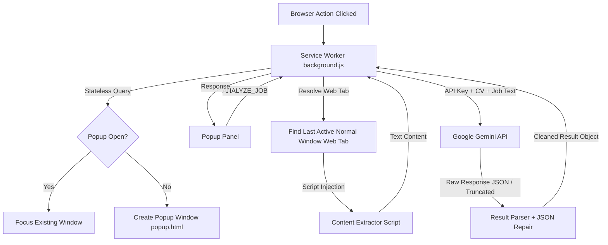

> **⚠️ WARNUNG / WARNING**  
> Diese Anwendung verstößt gegen Datenschutzgesetze, da sie Inhalte von Webseiten ohne Zustimmung der Betreiber extrahiert und an eine externe KI (Google Gemini) übermittelt.  
> **Nur für Testzwecke verwenden.**  
> In Zukunft ist geplant, die Analyse entweder über offizielle API-Schnittstellen der Jobportale oder komplett lokal über eine lokale LLM (z. B. Ollama) durchzuführen.

---

# Job Matcher AI

[](https://addons.mozilla.org/ru/firefox/addon/job-matcher-ai/)
[]()

> ⚠️ **Beta-Phase** – Dieses Projekt ist aktiv in Entwicklung. Kernfunktionen laufen stabil,
> aber es kann zu Fehlern kommen. Ich lade **Entwickler:innen und Jobsuchende ein**,
> mitzuhelfen, das Add-on zur Release-Qualität zu bringen!

A professional Firefox Extension that analyzes online job postings and compares them against your uploaded resume (PDF). If the match quality meets or exceeds your configured threshold (default 7/10), it automatically generates a customized cover letter (Anschreiben) tailored to the job requirements.

Powered by the **Google Gemini API**, Job Matcher AI runs completely locally inside your browser, respects your privacy, and utilizes a secure, warning-free implementation compliant with the latest Mozilla Add-on developer standards.

---

## 🚧 Beta & Mitmachen

**Job Matcher AI ist in der Beta-Phase.** Das bedeutet:

### ✅ Was bereits funktioniert
- Job-Analyse auf StepStone, Indeed, LinkedIn, XING, Arbeitsagentur, HeyJobs u. a.
- Anschreiben-Generierung (Deutsch) ab konfigurierbarem Score
- Sprach-Assistent (Fragen per Mikrofon)
- Lokale History (letzte 20 Auswertungen)
- 0 Lint-Fehler/Warnungen (AMO-konform)

### 🔧 Woran noch gearbeitet wird
- Weitere Unit-Tests für Edge-Cases
- Content Script (statt executeScript) für stabilere Extraktion
- Option für lokale/offene Modelle (kein API-Versand)
- Integration weiterer Job-Plattformen

### 🤝 Wie du helfen kannst
- **Issues melden** – Fehler oder Verbesserungsvorschläge
- **Pull Requests** – Code, Tests, Docs, Übersetzungen
- **Feedback geben** – Funktioniert es auf deiner Lieblings-Jobseite?
- **Ideen teilen** – Welche Funktion fehlt dir?

Du brauchst kein Frontend-Profi zu sein. Das Projekt wurde selbst mit LLM-Unterstützung entwickelt – jede Hilfe ist willkommen!

---

## Table of Contents

- [Key Features](#key-features)
- [Architecture & Mechanics](#architecture--mechanics)
- [German Application Best Practices & the "Übersetzungs-Regel"](#german-application-best-practices--the-übersetzungs-regel)
- [Security & Privacy Standards](#security--privacy-standards)
- [Installation & Test in Firefox for Developer](#-installation--test-in-firefox-for-developer)
- [Developer Guide](#developer-guide)
  - [Prerequisites](#prerequisites)
  - [Build and Run Tasks](#build-and-run-tasks)
  - [Testing](#testing)
- [License](#license)

---

## Key Features

- **Automated Content Extraction**: Reads and parses the text of the job description page automatically—even from copy-protected web pages—by avoiding standard `innerText` blocks and walking the DOM using `textContent`.
- **Match Score & Feedback**: Rates match quality on a scale from 1 to 10 and provides a detailed German explanation of matched and missing skills.
- **Cover Letter Generation**: Automatically writes a professional, tailor-made German cover letter if the match score is at least 7/10 (user-configurable).
- **Voice Assistant**: Allows you to record and ask voice questions via your microphone, using Gemini to respond instantly in German.
- **Stateless Window Lock & Bounds Constraint**:
  - Automatically restricts the extension popup window from spawning duplicates; multiple clicks on the icon focus the existing window.
  - Keeps the popup window nested strictly within the boundaries of your active browser window, preventing it from being dragged off-screen.
- **History Log**: Keeps a local history of your last 20 evaluations (stored locally inside `chrome.storage.local`).
- **Ubuntu Design System**: A premium dark-mode interface styled according to the Ubuntu design palette and font guidelines.

---

## Architecture & Mechanics



1. **Service Worker (`background.js`)**: Orchestrates extension actions. It tracks window focus dynamically, resolves which web tab to extract text from (ignoring internal extension pages), and contacts the Gemini API.
2. **Popup Window (`popup.html` / `popup.js`)**: Displays the main application. It features a self-contained window position constrainer that polls current coordinates and snaps the popup back if moved beyond the active browser window.
3. **Robust JSON Recovery (`result-parser.js`)**: Features an advanced recovery parser. If Gemini hits its output token limit or safety block and returns truncated text, the parser auto-completes unclosed string quotes, tags, and brackets to salvage the score and reasoning instead of failing.

---

## German Application Best Practices & the "Übersetzungs-Regel"

When generating cover letters, Job Matcher AI does not merely listing skills or copy-paste text. It is instructed to follow premium German HR standards under the **"Übersetzungs-Regel"** (Translation Rule):
- **Requirement Translation**: Translates each critical job requirement into concrete evidence, accomplishments, or project examples from the candidate's CV (rather than making empty claims).
- **Format Compliance**: Structured professionally with an appropriate greeting, a tailored introduction referencing the job, 2-3 body paragraphs proving experience, clean company motivation, and a formal closing with availability.
- **Placeholder-Free**: Outputs a completed, ready-to-send cover letter without annoying placeholders (like `[Name]` or `[Date]`).

---

## Security & Privacy Standards

- **0 Warnings & 0 Errors**: Job Matcher AI is fully compliant with the strict security requirements of the Mozilla Add-on developer guidelines. It completely avoids `innerHTML` and uses secure DOM APIs (`replaceChildren()`, `createElement()`, `textContent()`, `createTextNode()`) to guarantee zero unsafe variable assignment notices.
- **100% Local Storage**: Your API Key, CV (PDF), and evaluation history are kept local inside your browser (`chrome.storage.local`). No developer servers, trackers, or telemetries are used.

---

## 🔧 Installation & Test in Firefox for Developer

### 1. Firefox for Developer Edition herunterladen
→ [https://www.mozilla.org/de/firefox/developer/](https://www.mozilla.org/de/firefox/developer/)

Diese Version hat separate Profile und `about:debugging` für unzignierte Add-ons.

### 2. Add-on bauen
```bash
git clone <repo-url>
cd Job-Matcher-AI
npm install
npm run build
```

Das erstellt ein `dist/`-Verzeichnis mit allen benötigten Dateien.

### 3. Temporäres Add-on laden (about:debugging)

1. Öffne Firefox for Developer
2. Gehe zu `about:debugging#/runtime/this-firefox`
3. Klicke auf **„Dieses Firefox“** (im linken Menü)
4. Klicke auf **„Temporäres Add-on laden…“**
5. Wähle die Datei `dist/manifest.json` aus

Das Add-on ist jetzt aktiv, solange Firefox läuft.

> 💡 **Tipp:** Bei Code-Änderungen einfach erneut `npm run build` ausführen
> und in `about:debugging` auf den „Neu laden“-Button des Add-ons klicken.

### 4. Alternative: web-ext (automatisches Neuladen)

```bash
npx web-ext run --source-dir=dist
```

Startet Firefox for Developer automatisch mit geladenem Add-on
und überwacht Änderungen im Quellcode.

### 5. Testen

1. Gehe zu einer beliebigen Stellenanzeige (z. B. StepStone, Indeed)
2. Klicke auf das Job Matcher AI-Icon in der Toolbar
3. Gib deinen Gemini-API-Key und Lebenslauf (PDF) in den Einstellungen ein
4. Klicke auf „Stelle prüfen“
5. Sieh dir Score, Begründung und (optional) Anschreiben an

### 🔗 Nützliche Links

| Link | Beschreibung |
|------|-------------|
| [Firefox for Developer](https://www.mozilla.org/de/firefox/developer/) | Browser zum Testen unsigned Add-ons |
| [about:debugging](about:debugging#/runtime/this-firefox) | Temporäre Add-ons laden |
| [Gemini API Key](https://aistudio.google.com/apikey) | Kostenloser API-Key von Google |
| [web-ext Dokumentation](https://extensionworkshop.com/documentation/develop/web-ext-command-reference/) | CLI-Tool für Extension-Entwicklung |
| [Mozilla Extension Workshop](https://extensionworkshop.com/) | Offizielle Dokumentation |
| [AMO – Job Matcher AI](https://addons.mozilla.org/de/firefox/addon/job-matcher-ai/) | Veröffentlichte Version |

---

## Developer Guide

### Prerequisites
- Node.js (version 18 or higher)
- npm

### Build and Run Tasks
Install dependencies:
```bash
npm install
```

Compile TypeScript and build assets with `esbuild`:
```bash
npm run build
```

Watch mode for development:
```bash
npm run build:watch
```

Run linter checks (ensure zero warnings/errors before packaging):
```bash
npm run lint:ext
```

### Testing
Run unit tests (Vitest):
```bash
npm test
```

---

## License

This project is licensed under the MIT License. The Ubuntu font is licensed under the SIL Open Font License (see `src/assets/fonts/`).
